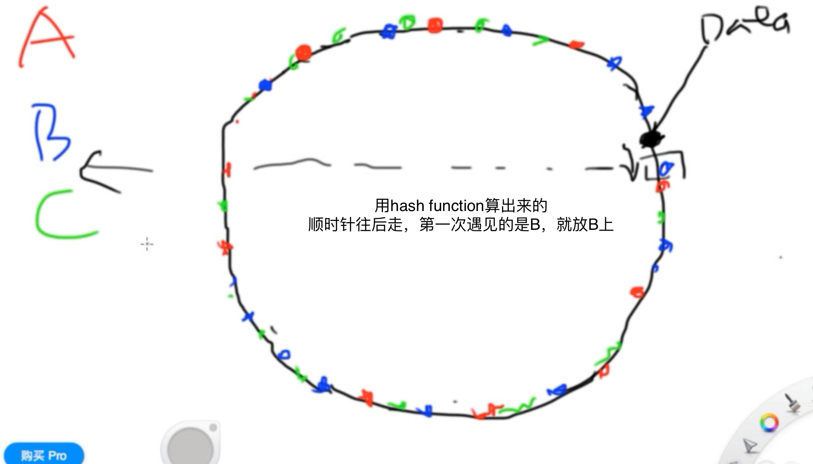
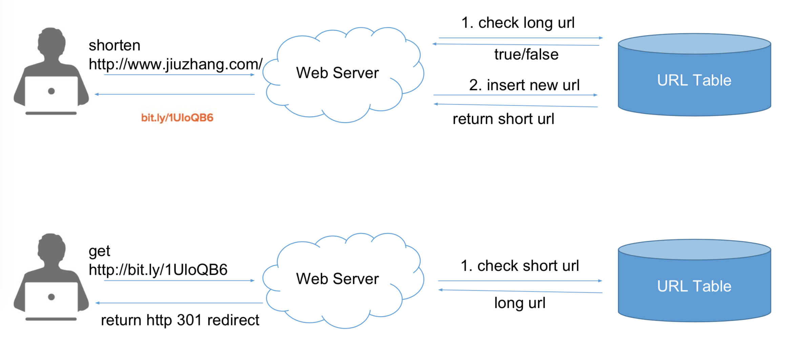

# 一致性哈希算法

## Sharding (Partition)
* Vertical
  * 不同的 Table 放在不同的DB里
* Horizontal
  * 一致性哈希

### 具体算法
* 最基本, 连续区间
  * 假设 ABC 各占120的饼, D要进来
  * 将用空得比较多的相邻的俩AB，匀给D,即ABC各80, D占120
  * 缺点，AB的迁移压力特别大
* 再优化，碎片区间
  * 取模再大一点的数字，instead of 36
    * 用 2^64 - 1 (习惯性用法，世界上所有的东西都是一个数据的话，2^64), 这是mod数，不是N
  * 不再是slice of 饼, 而是一个个"点"
    * `虚拟节点遍布整个环 micro shards`
    * 每加入一台，就在环上撒 1000 个点

* 每个点(假设B)逆时针往前直到上一个点(假设A)所覆盖的区域，即数据存在哪台机器(B)
  * 新加一个进来，若被分在 A-B之间，那 C 是问 B 要数据迁移

* 这样一个“环”，用什么数据结构？且如何创建？
  * “环”根本不需要存的数据，完全是指针
  * 用 TreeMap
    * `Treemap` 主要用途 在 `LogN 的复杂度`找到`比某个数小`的数

## Replica
* Backup 和 Replica 什么区别?
  * Backup 定期做，Replica `同时做`
  * Backup 是死数据, Replica 是实时的，写入时就复制，便于恢复
  * Replica 需要分摊读

* SQL 用 Master Slave 实现
  * Master 负责写，Slave 负责读
  * Slave 从 Master 中同步数据
* `Write Ahead Log`
  * SQL 的任何操作，都以Log做一份记录
  * WAL 是必须先写进Log，再写进DB
    * Slave 通知 Master 说我在了
    * Master 有操作就让 Slave 来读 Log
    * Slave 数据有 “延迟”

* NoSQL 用 consistent hashing 实现
  * 顺时针存3份

# 设计短网址系统
* bitly.com

## 4S 分析
* Scenario
  * 容易忽略: 长网址还原为短网址的的需求
  * 3个步骤

  * QPS (`#User-User Writes-User Reads-Store Data`) 
    1. DAU 100M
    2. 每人每天写入 0.1 条URL，即发一条tweet
       * 100M * 0.1 / 86000 = 100
       * Peak = 100*3 = 300
    3. 每人每天访问 1 条URL
       * 100M / 86000 = 1000
       * Peak = 1000 * 3 = 3000
    4. 占用的存储空间
       * Cache 100M * 0.1 = 10M 
       * 一条长度约 100Byte = 10M 就是 1G

* Service
  * `UrlService.encode(long_url)`
    * POST /data/shorten/{long_url}
  * `UrlService.decode(short_url)`
    * GET /{short_url}

* Storage
  * 是否需要支持 Transaction? No => NoSQL
  * 复杂的细节查询? No => NoSQL
  * 是否需要快？更少的Labor? Yes, 因为大多数对于SQL的兼容都很好，有很多Library => SQL
  * QPS 的要求高否? No => SQL
  * Scalability 要求? 因为QPS和storage都不高，No => SQL
  * 是否需要 Sequential ID? 即自增ID? 不一定
    * `NoSQL 不支持 自增ID`

## 具体解法
* 取长网址的最后10位 MD5 一下，不work
  * 缺点: 会有冲突

### 随机生成可以
* 随机生成 一个6位的Short URL
  * 如果被用过了，就再生成一个
  * 如果没用用过，绑定给一个long URL
  * 即用DB来去重
  * 缺点：太多的话会越来越慢
* `但是需要对，shortkey，longURL 加 index`
* 这种方法用 `NoSQL`


### Base 62 进制转换法
* 将 6 位的short url 看作一个62进制的数
  * `62进制看作，a-z A-Z 0-9，即62个不同的字符`
  * 为何6位? 62^6 = 570亿，已经非常多了，够用了
* 缺点：依赖全局自增ID
```java
// 用id去拿数据库里的那一条
int shortURLtoID(String shortURL) {
    int id = 0;
    for (int i = 0; i < shortURL.length(); i++) {
        id = id * 62 + toBase62(shortURL.charAt(i));
    }
}

String idToShortURL(int id) {
    String chars = "0123456789abcdefghijklmnopqrstuvwxyzABCDEFGHIJKLMNOPQRSTUVWXYZ";
    String short_url = "";
    while (id > 0) {
        short_url = chars.charAt(id % 62) + short_url;
        id = id/62;
    }

    while (short_url.length() < 6) {
        short_url = "0" + short_url;
    }
    return short_url;
}
```
* base64 is `[a-z,A-Z,0-9]` 和 `.` `-`
  * `6 letter key is 64^6 = 68 billion possible strings`
* append user id to the input URL to make it unique


  * `用Cache Aside`，`Memcached只用来加速!`
  * 需要永远保存，因为有时候已经放在pdf里了
  * 优化服务器速度(创建短地址)
    * 中国的网址用中国的服务器
    * 通过DNS解析不同地区的用户去不同的服务器
    * 但最后存的话，都是shared DB
  * 优化数据访问速度(redirect)
    * Centralized SQL + Distributed Memcached
    * 一个SQL配多个 Memcached, Memcached 跨地区分布

## Tiny URL 2种方法的优化
* Scale `存不下Storage，忙不过来QPS`
  * 写操作越来越多(DDoS)
    * Vertical Sharding 不行，因为Tiny URL只有一个表
    * 用 Horizontal Sharding
      * consistent hashing
    * `什么都能做 Sharding Key，但算出来的结果是有范围的, 就是DB0~DBn`
* `没有必要1对1，一个Long可以有多个Short，反之不行`
* AB1234 扩展为 0AB1234
  * 即把这一位0单独拿出来做sharding key


## Custom URL
* 建一张Custom的独立的表，但最终还是和总表互动
  * 一个Long 可以有 Short，也可以有 Custom
* 不要建立3个col的Table, custom一栏会一直为空
  * short | custom | long 
* 先查自定义的是否在 总表中存在


## 另外的解法
## URL Shortening
### What's it for?
* hiding affiliated URL
  * analyze audience
  * monitor ad performance

### Requirements 
#### 1.Functional
* Can redirect to the original
* Can be customized
* Should expire

#### 2.Non Functional
* Should Highly `Available` 
* Redirect should take little latency
* Should not be predictable

#### 3.Follow Up
* How many redirect a day?
* Others can access by API

### Capacity (TMSB) 他妈傻逼
#### 1.Traffic (Monthly)
* Redirection
  * `Read/write Ratio` is `100:1`
  * 500M New short URLS
  * 500M*100 = 50 Billion Redirection
* Queries Per `Second` for shorting
  * 500M/(30days*24hours*3600sec) = 200 /s
* QPS for redirecting
  * 50B/(30days*24hours*3600sec) = 20 K/s

#### 2.Storage (5 yearly)
* URL shorting: 500M per month
  * 500*12*5 = 30 billion
* Every URL is 500 Bytes
  * 30 billion * 500 = 15 TB

#### 3.Bandwidth - QPS
* 200 * 500 Bytes = 100KB/s

#### 4.Memory `8-2 Rule` from Traffic
* Cache frequent URLs `Only the redirecting not new`
* 20K/s*(3600*24) = 1.7 billion
  * 0.2*1.7 billion * 500 Bytes = 170GB

### API Define

* `createURL()`
* `deleteURL()`
```java
createURL(api_dev_key, original_url, custom=None, user_name=None, expire_date = None)
// "=" means default value
// show optional params
returns ? shortURL : error code

deleteURL(api_dev_key, url_key)
// api_dev_key is like a password
```

#### How to prevent abuse?
limit `api_dev_key` for some time

### Database
* Aware!
  * Each object is small
  * Read heavy
  * no relationship - except which user stores what
* billions so use NoSQL

```sql 
/* URL */

PK: Hash: varchar(16)
OriginalURL: varchar(512)
CreationTime: datetime
ExpirationTime: datetime
UserID: int

/* User */
PK: UserID: int
Name: varchar(20)
CreationDate: datetime
LastLogin: datetime
```


#### Solution 2 - Generate Keys offline
* Once used, marked for not use again
* So concurrency problem?
  * Have 2 tables - used and not used
  * Can keep a cache 
    * As soon as loads to memory, moves key to used
  * no same keys to multiple server, use synchronize (or lock) holding keys before giving out to server
* DB size?
  * 1 byte for char, then 6*68Billion(unique strings) = 412GB
* How to avoid single point of failure?
  * keep a standby replica
* Cache accident
  * if DB dies before assigning keys(memory清空),acceptable since 68 billion
* How to look up?
  * `HTTP 302 Redirect` or `404 Not Found`
* Should limit customized key to like 16 chars


### Data Partition and Replication
* Range Partition
  * all starts with an "A" on one server
  * cause unbalanced, e.g. too many "E" URLs
* Hash Partition
  * always map some keys into a server number
  * cause overloaded partitions, solved by `Consistent Hashing`

### Cache
* modern day server has 256 GB memory
* can use LRU(LinkedHashMap)
* How do we update replica server?
  * When cache miss, update cache and pass that to all server, if exists, ignores it
